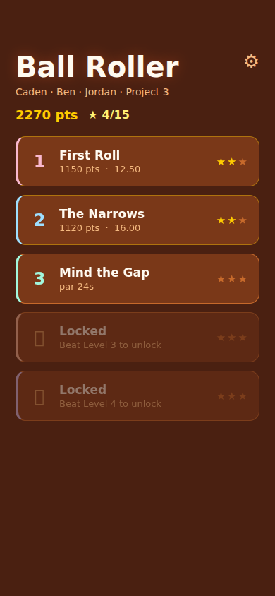
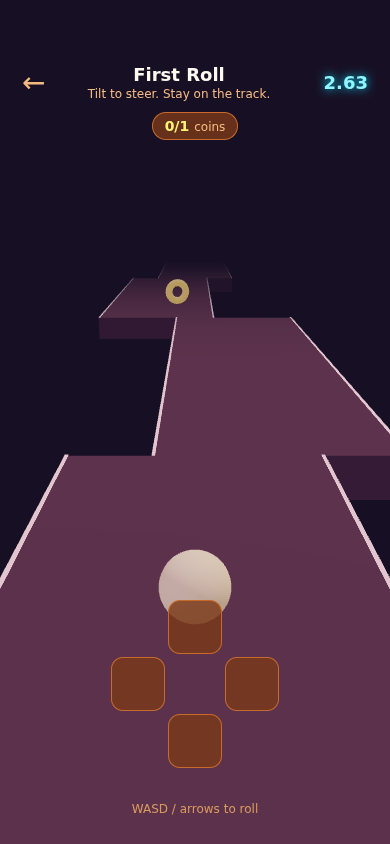
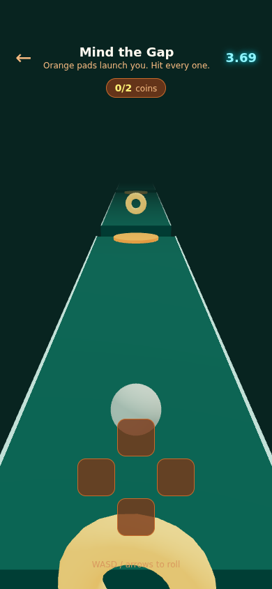
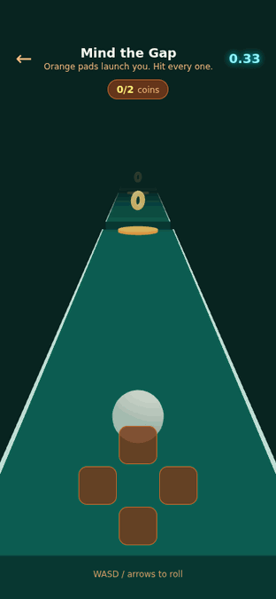

# Ball Roller &mdash; Project 3

A 3D tilt-controlled ball rolling game on a narrow track threaded through
open sky, thousands of feet above a cloud deck. Tilt to roll the ball along a
centreline that bends, banks, climbs and plunges; jump the gaps off bounce
pads, slam through speed boosters, dodge the spinners, find the switch that
opens the gate, and try not to fall off the sides.

By Caden Lund, Ben Gutowski and Jordan Berger.

## In game

Actual browser captures of the app at a phone-sized viewport. The menu uses sample
saved progress to show unlocked levels; the gameplay uses the real physics and
keyboard input.

| Level select | First Roll · dusk rose | Mind the Gap · lagoon |
|---|---|---|
|  |  |  |



## Team and feature ownership

| Person | Features |
|---|---|
| Caden Lund | Physics, level design and engine tests; ongoing work: calibration, pause/resume, later levels, moving platforms and CI (#1–#5). |
| Ben Gutowski | Menu and level selection, score/results presentation, persistent settings, tutorial and countdown/HUD polish. |
| Jordan Berger (`JordanFFBerger`) | Sound effects (#11), haptics (#12), pickup/impact/finish animations (#13), per-level palettes and track edges (#14), app branding and this media gallery (#15). |

## Controls

The ball goes only where the phone is tilted, like a marble on a board.
Neutral is a natural hold with the phone tipped ~45&deg; toward you: tip it
away to roll forward, pull it upright to brake and roll back, tilt sideways
to steer. Each level caps how fast the ball can roll.

Where there is no accelerometer (simulator, web, desktop) the game falls back
automatically: **WASD or arrow keys** on web, and an on-screen D-pad
everywhere else. `useTilt` picks the source at startup; nothing else in the
game knows or cares which one is live.

## Layout

| Path | Purpose |
|---|---|
| `src/game/levels.js` | Track geometry and the eight level definitions: pieces, pads, boosters, spinners, coins |
| `src/game/engine.js` | Ball physics: rolling, steering, slope gravity, falls, pads, boosters, spinners |
| `src/game/scoring.js` | Points, stars, time formatting |
| `src/game/progress.js` | Best score per level, saved to device storage |
| `src/game/useTilt.js` | Accelerometer input with keyboard fallback |
| `src/components/Scene.js` | Draws a level with three.js (via expo-gl), and the camera that follows the line |
| `src/components/trackMesh.js` | Sweeps a piece's centreline into deck and rail geometry |
| `test-utils/autopilot.js` | The reference driver: follows the centreline, or a puzzle's shipped route |
| `src/components/Sky.js` | The graded sky, the sun, the stars, the cloud decks and the ground far below |
| `src/game/camera.js` | The chase camera, as pure functions - so "can you see the ball" is testable |
| `src/screens/` | Level select and gameplay screens |
| `__tests__/` | Tests for physics, scoring, settings, feedback and themes |

### Why it is split this way

`engine.js` and `scoring.js` are pure functions over plain data &mdash; no
React, no three.js, no timers. `step(state, level, tilt, dt)` returns a new
state and never mutates its input, so the entire game can be simulated in a
test without a device or a GPU. The suite leans on that: it rolls each level
for thousands of frames to assert the ball never sinks through the track,
that every gap has a launcher strong enough to clear it, that no climb is
steeper than the ball can get up and no curve turns harder than it can steer
through, and that every level can be finished clean by a driver that only
follows the centreline.

`Scene.js` is the opposite: purely a view. It reads the engine state every GL
frame and moves meshes to match, and owns no game logic at all.

Levels are authored as a `run` &mdash; an ordered list of pieces, each saying
how the centreline *changes* across it rather than where it sits: `bend`
sweeps it sideways, `wave` weaves it, `rise` climbs, `crest` arcs it over a
hill or scoops it into a dip, `gap` leaves a hole to jump and `step` drops the
far side of that hole. Every piece starts where the last one ended &mdash;
same position, same height, same width, same heading &mdash; so the track is
continuous by construction and a level reads as a journey rather than a pile
of coordinates. Props are placed the same way: `across` is metres from the
centreline and `lift` is metres above the deck, so a coin stays a coin whether
the track under it is level or banked through a curve forty metres up.

The shaping functions all go to zero at both ends of a piece in their value,
their slope **and** their curvature. Matching position stops a step at the
seam; matching heading stops a kink; matching curvature stops a crease, and is
the same idea as the clothoid transitions real roads use, where curvature ramps
in and out rather than switching on. The renderer only caps a piece's ends
where the track actually stops, and the deck width tapers across a piece
rather than stepping at the joint, so a run of pieces is indistinguishable
from one continuous ribbon.

### Banking is physics, not decoration

Corners lean, and the lean is real. `bankAt` rolls the deck with the
centreline's *curvature* (so straights and constant-angle diagonals stay flat
and only actual corners tilt), the outside edge goes up, and the engine grounds
the ball on `surfaceAt` &mdash; the height of the banked surface under the
ball's own lateral position, not of the flat centreline beside it. Gravity down
that camber is what makes a banked turn hold the ball through it, which is the
same trick real roads use to shift horizontal force into vertical.

This matters beyond feel: when the drawn deck leans and the simulated deck does
not, the ball visibly sinks into the raised half of every corner.
`__tests__/banking.test.js` checks the drawn cross-section against
`surfaceAt` at every sample of every segment in the game, so the two cannot
drift apart again.

Landing is a **crossing**, not a position. Testing only whether the ball is
below the deck and over track means anything that ends up underneath the level
gets stood back up on it &mdash; and on a track that bends, climbs and slides, a
ball that has rolled off the outside of a corner very often *does* end up
underneath it a moment later. `deckPlaneAt` answers "where would a resting ball
sit here" for any point at all (on the deck, off its edge, or out over a gap),
and a ball only lands if it was at or above that a step ago. Before this,
`__tests__/falling.test.js` could rescue balls from ten metres down.

A grounded ball matches `surfaceRate` &mdash; the rate the surface under it is
moving, along its length **and** across its camber. The sideways half is not
optional: a ball sliding down a banked corner is running off a descent even
where the track is perfectly level along its length, and matching only the
gradient means the deck drops out from under it the instant a corner starts.

How hard a corner leans is derived, not chosen: `tan(bank) = v² · curvature / g`
is the angle that balances a corner exactly, so a gentle bend leans gently and
a tight one leans hard, and the lean is readable as information about the
corner. Lean much past balance and the camber stops being grip and becomes a
slide the player has to fight.

Spinners are mounted the same way &mdash; in the plane of the deck they sit on,
pitched down its slope and rolled with its camber &mdash; because a rigid bar
hung level over sloping track saws straight through it.

### You have to be able to see the ball

The camera is not in the renderer. It lives in `src/game/camera.js` as pure
functions over plain data, because whether the ball is on screen is not
something to find out about on a device. `__tests__/camera.test.js` drives
every level through its reference solution, projects the ball into clip space
each frame, and fails if it ever leaves the frame or ends up behind the lens.

Two things that test caught. The camera only ever looked *up* the track, so on
the two levels solved by driving backwards the ball simply left the frame
behind the lens - which from the seat reads as the ball vanishing. It now
swings round, and swings as an **orbit**: interpolating the seat through world
space would drag the camera straight through the ball on the way past, whereas
interpolating the angle carries it round the outside. And held upright a phone
has only about fifteen degrees of view to either side, so a wide junction or a
cannon shot put the ball off the edge even facing the right way. Keeping it in
frame is now a hard constraint: whatever the camera would *like* to look at,
the aim is pulled back toward the ball by exactly as much as it takes.

### Ambience

Everything in the sky is generated from theme colours and drawn with unlit
vertex colours or instancing - no textures, no shaders, nothing that behaves
differently on expo-gl than in a browser.

- A graded dome with the sun's bloom baked into its vertex colours, and the
  scene's key light pointed along the same direction, so the lit side of
  everything agrees with the sky behind it.
- Stars, biased toward the zenith where the sky is darkest, because at this
  altitude it nearly is.
- Cloud below **and** a thinner veil above, so the track hangs *between*
  layers rather than over one.
- A trail of fading ghosts behind the ball, laid down at a fixed rate so the
  spacing reads as speed rather than as framerate; a point light travelling
  with it, because a marble with no light of its own in a sky this big reads
  as a dot; expanding rings on every landing, pad, booster and finish; and a
  shaft of light standing over the goal so the end of the level is somewhere
  you can see rather than somewhere you arrive at.
- Under the wind, a drone: a slow stack of detuned fifths that reacts to
  nothing. Wind tells you how fast you are going; the drone only tells you
  where you are, and it has to be steady or it stops meaning that.

### Performance

The physics runs at a fixed 120Hz with up to 8 catch-up steps a frame, so the
geometry functions are called thousands of times a second and are written for
it. `bankTanAt` returns the *tangent* of the bank rather than the angle:
because the angle is `atan` of the balance term and `tan(atan(v))` is `v`, and
clamping the angle is the same as clamping `v` (atan is monotonic), the whole
hot path &mdash; surface height, deck width across a lean, camber force, resting
height &mdash; comes out exact with no trigonometry at all. `surfaceRate` is
solved by hand and takes its one numerical derivative on curvature, the
cheapest thing in the chain, rather than by sampling the surface twice. Pieces
that never bend or never climb are flagged at build time so the hot path can
bail out immediately, which most of them do.

Measured on level 8: a minute of simulation went 12.9µs → 8.7µs per step,
`segmentAt` 774ns → 525ns, `surfaceAt` 1219ns → 682ns. The track draws as two
meshes per segment rather than three (18 draw calls on the longest level), and
the per-frame camera and switch updates no longer rebuild a projection matrix
or re-parse a colour string every frame.

## Levels

Each level is built around one idea rather than a difficulty number, and from
level 7 on that idea is usually a puzzle rather than a test of nerve. The track
is narrow throughout &mdash; nothing is wider than five metres and the thinnest
is 2.4.

| # | Name | The puzzle | Par |
|---|---|---|---|
| 1 | First Light | A curve. The one level that only asks you to drive | 16s |
| 2 | The Narrows | Precision: it narrows and it weaves, but never both hard at once | 22s |
| 3 | Mind the Gap | Reading an arc. Four gaps, and the far ledge steps up and down | 25s |
| 4 | Slipstream | Momentum as a resource: the ramp at the end needs boost you still have | 19s |
| 5 | Spin Cycle | Timing, uphill and down, so no two bars are met at the same speed | 28s |
| 6 | Sidewinder | Patience: three sliding decks, the last across a gap | 25s |
| 7 | **Ballast** | You cannot be heavy and light at once | 38s |
| 8 | **The Cannon** | Nothing here can be jumped. Which barrel, and how do you reach it | 34s |
| 9 | Corkscrew | The descent: a banked weave dropping 24m through two full swings | 24s |
| 10 | **The Balance** | Balance, and nothing else. 2.4m of deck, wound three times | 38s |
| 11 | The Locksmith | A lock whose key is behind you, on a twelve-second timer | 46s |
| 12 | The Long Way Home | All of them in sequence, with nowhere flat to recover | 38s |

**Ballast** is the clearest statement of the idea. The plate that opens the door
is a weighted one &mdash; only a heavy ball presses it &mdash; but the jump at
the end is an *impulse*, and an impulse barely lifts a heavy ball. So the answer
is to go out heavy, open the door, and then go back for the light ballast before
using it. Both stations sit in lanes you can steer around, so the return trip
isn't undone by the station it passes on the way.

**The Cannon** is about aim you don't control. A cannon's aim is fixed, so the
question is never how to shoot it &mdash; it's which barrel you need and how to
get into it. The launch platform carries two: the right one is aimed at the
onward track, which is gated; the left is aimed at an island over nothing, which
holds the switch and a third barrel to get back off again.

**The Balance** is the skinny one. A corkscrew wound twice and dropped thirty
metres on a deck barely wider than two ball diameters, and slow on purpose
&mdash; slow means the corner is banked for a slow ball, and a deck leaning this
hard under a ball this size is something you hold a line across rather than
steer along.

Levels that are puzzles ship their intended solution as a `route` of waypoints,
which is what `test-utils/autopilot.js` drives and `__tests__/puzzle.test.js`
and `__tests__/mechanics.test.js` verify. So the build fails if a puzzle stops
having an answer &mdash; and separately if it becomes solvable by just holding
forward.

### The pieces a puzzle is made of

| | |
|---|---|
| **pads** | bounce pads. An impulse, so weight changes how far they throw you |
| **boosters** | green arrows hovering over the deck; raise the speed cap for a beat, and with `launch` they are ramps |
| **cannons** | roll in and it holds you, then fires you along a fixed aim |
| **ballast** | heavy or light. Changes only what can be *done* to the ball &mdash; how far an impulse throws it, how hard a bar can shove it |
| **switches / gates** | id-matched. `needs` makes a plate only a heavy ball can press; `hold` makes it a timer that shuts again |
| **spinners** | bars sweeping in the plane of the deck they are mounted on |
| **moving platforms** | decks that slide side to side under you |
| **spurs** | side lanes running alongside the main one &mdash; a fork, and the only way a route can double back |

### Where the design came from

Two outside ideas are load-bearing here. **Super Monkey Ball 2** introduced
switches that act on the stage itself, which is what turns a course into a
puzzle &mdash; and its stages are built so each one teaches a single new
application of the physics rather than stacking difficulty. That is the rule
every level here follows: The Narrows narrows *or* weaves, never both hard at
once. And racing-track practice supplied the geometry &mdash; track slices
carrying bank angle and pitch, clothoid transitions so curvature ramps rather
than jumps, and banking used to move horizontal force into vertical.

Sources: [Super Monkey Ball 2](https://en.wikipedia.org/wiki/Super_Monkey_Ball_2),
[A Rational Approach To Racing Game Track Design](https://www.gamedeveloper.com/design/a-rational-approach-to-racing-game-track-design),
[full tilt (on Super Monkey Ball level design)](https://colekronman.substack.com/p/full-tilt).

## Scoring

1000 base, +40/second under par, +250 per coin, -150 per fall, floored at
zero. Stars: one for finishing, two for beating par, three for every coin.
Levels unlock in order, and the best run per level is kept on device.

## Working on it

Branch, open a pull request, get a green check, merge. Every push and pull
request runs the full suite on GitHub Actions
(`.github/workflows/test.yml`), and `main` requires it to pass, so a broken
physics change cannot land by accident.

The suite is the fast way to know a change is sound: `engine.js`,
`levels.js`, `scoring.js` and `loop.js` are all pure functions over plain
data, so they run without a device or a GPU. Anything that changes how the
ball moves should come with a test that would have caught the change going
wrong &mdash; the level suite already refuses geometry that is unplayable,
and `__tests__/playable.test.js` refuses a level that cannot be finished or
a par that cannot be beaten.

```bash
npm test            # the whole suite
npm test -- engine  # one file, by name
```

## Running it

Install Node.js 24 LTS (includes npm) and Expo Go compatible with SDK 57 on your
phone. In the project directory:

```bash
npm ci
npm test -- --runInBand
npx expo start      # scan the QR code with Expo Go
```

Use the same Wi-Fi network, or `npx expo start --tunnel` if the phone cannot
reach the computer. For browser play, run `npm run web` and use WASD/arrow keys.
On Ubuntu, if DevTools reports missing shared libraries, install
`sudo apt-get install libnspr4 libnss3 libasound2t64`.

The Sound and Haptics switches in Settings apply immediately. Haptics need a
physical device and are disabled on web. Rolling audio stops when stationary,
airborne, backgrounded or outside gameplay.

## App branding

`assets/branding/mark.svg` is the editable, original ball-on-track mark. Its PNG
exports provide the app icon, Android adaptive foreground and splash image via
`app.json` and the `expo-splash-screen` plugin. Regenerate with
`node scripts/generate-branding.cjs` after installing the optional `sharp` tool.
The branding artwork is CC0 1.0, like the sound assets below.

Icon and splash changes require a fresh native build (`npm run android` with
Android Studio/SDK installed, or `npm run ios` on macOS with Xcode). Expo Go does
not reproduce the installed app's splash screen; verify a release build as
[Expo documents](https://docs.expo.dev/develop/user-interface/splash-screen-and-app-icon/).

For device review: collect a coin, launch from a pad, land, hit a spinner, fall,
and finish a level. Repeat with Sound/Haptics disabled. Check each level palette,
then background/foreground the app and confirm audio does not continue in the
background. Particle effects use a fixed pool and a single instanced draw call;
60fps still needs profiling on the target phone.


## Sound credits

The seven WAV effects in `assets/sounds/` are original synthesized sounds created
for Ball Roller and dedicated to the public domain under CC0 1.0
(https://creativecommons.org/publicdomain/zero/1.0/). No sampled recordings are used.
Regenerate them with `python3 scripts/generate-sounds.py`. Audio uses `expo-audio`;
the Sound setting mutes effects and the rolling loop, including pending playback.

### Reproducing the README captures

Install optional capture tools outside the app dependencies:

```bash
npm install --prefix /tmp/ball-roller-media playwright sharp gifenc
/tmp/ball-roller-media/node_modules/.bin/playwright install chromium
npx expo export --platform web --output-dir /tmp/ball-roller-web
python3 -m http.server 8088 --bind 127.0.0.1 --directory /tmp/ball-roller-web
# In a second terminal, from this repository:
NODE_PATH=/tmp/ball-roller-media/node_modules node scripts/capture-media.cjs
```

The capture script seeds sample progress in its isolated browser profile and
records keyboard-controlled play; it does not change your saved phone progress.
